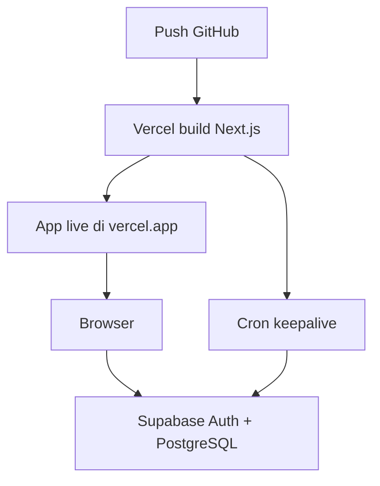

# Panduan Deploy InvoiceFlow — Supabase + Vercel

Langkah demi langkah dari nol sampai aplikasi live di internet.

**Repo:** https://github.com/saptaagung/website_E-invoice

**Urutan:** Supabase dulu → Vercel → uji coba.

---

## Ringkasan

| Langkah | Platform | Waktu (perkiraan) |
|---------|----------|-------------------|
| 1–5 | Supabase (database + auth) | ~15 menit |
| 6–10 | Vercel (hosting app) | ~10 menit |
| 11 | Uji coba production | ~5 menit |

---

## Bagian A — Supabase

### Langkah 1: Buat akun & project

1. Buka [https://supabase.com](https://supabase.com) → **Start your project** / **Sign in**.
2. Klik **New project**.
3. Isi:
   - **Name:** `invoiceflow` (bebas)
   - **Database password:** buat password kuat → **simpan di password manager**
   - **Region:** pilih terdekat (mis. `Southeast Asia (Singapore)`)
4. Klik **Create new project** → tunggu 1–2 menit sampai status **Active**.

---

### Langkah 2: Jalankan schema database

1. Di dashboard Supabase, buka **SQL Editor** (menu kiri).
2. Klik **New query**.
3. Di komputer Anda, buka file `supabase/schema.sql` dari repo ini.
4. **Salin seluruh isi** file → tempel di SQL Editor.
5. Klik **Run** (atau Ctrl+Enter).
6. Harus muncul pesan sukses (tanpa error merah).

Ini membuat tabel (`profiles`, `clients`, `invoices`, dll.), **Row Level Security**, dan trigger untuk user baru.

---

### Langkah 3: Atur autentikasi (email)

1. Buka **Authentication** → **Providers**.
2. Pastikan **Email** dalam keadaan **Enabled**.
3. Untuk production awal / testing mudah:
   - Buka **Authentication** → **Sign In / Providers** → **Email**
   - **Nonaktifkan** opsi **Confirm email** (supaya setelah register bisa langsung login).
   - Untuk production ketat, aktifkan lagi nanti dan arahkan user cek inbox.

---

### Langkah 4: Salin kunci API

1. Buka **Project Settings** (ikon gear) → **API**.
2. Catat nilai berikut (akan dipakai di Vercel):

| Di Supabase | Environment variable di Vercel |
|-------------|-------------------------------|
| **Project URL** | `NEXT_PUBLIC_SUPABASE_URL` |
| **Publishable key** (atau **anon** `public`) | `NEXT_PUBLIC_SUPABASE_PUBLISHABLE_KEY` |

**Penting untuk URL:**

- Benar: `https://abcdefghijklmnop.supabase.co`
- Salah: `https://....supabase.co/rest/v1` ← jangan sertakan `/rest/v1`

---

### Langkah 5: (Opsional) Cek tabel

1. Buka **Table Editor** → pastikan ada tabel `profiles`, `clients`, `invoices`, `quotations`, `company_settings`, dll.
2. Tabel `auth.users` akan terisi setelah ada user yang register dari aplikasi.

---

## Bagian B — Vercel

### Langkah 6: Import repository GitHub

1. Buka [https://vercel.com](https://vercel.com) → login (disarankan **Continue with GitHub**).
2. Klik **Add New…** → **Project**.
3. Cari repo **`saptaagung/website_E-invoice`** → **Import**.
4. Konfigurasi build (biasanya auto-detect):

| Setting | Nilai |
|---------|--------|
| Framework Preset | **Next.js** |
| Root Directory | `.` (root repo, jangan `client` atau `server`) |
| Build Command | `npm run build` (default) |
| Output Directory | (default Next.js) |
| Install Command | `npm install` (default) |

**Jangan** ubah root ke folder lama `client/` — sudah tidak dipakai.

---

### Langkah 7: Tambahkan environment variables

Sebelum klik **Deploy**, buka **Environment Variables** dan tambahkan:

| Name | Value | Environment |
|------|--------|-------------|
| `NEXT_PUBLIC_SUPABASE_URL` | Project URL dari Langkah 4 | Production, Preview, Development |
| `NEXT_PUBLIC_SUPABASE_PUBLISHABLE_KEY` | Publishable / anon key | Production, Preview, Development |
| `CRON_SECRET` | String acak panjang (lihat bawah) | **Production** saja |

**Membuat `CRON_SECRET`:**

- PowerShell: `[guid]::NewGuid().ToString() + [guid]::NewGuid().ToString()`
- Atau gunakan password generator 32+ karakter.

`CRON_SECRET` dipakai oleh Vercel Cron untuk memanggil `/api/cron/keepalive` (agar project Supabase free tier tidak pause).

---

### Langkah 8: Deploy

1. Klik **Deploy**.
2. Tunggu build selesai (biasanya 1–3 menit).
3. Jika build **gagal**, buka **Build Logs** — perbaiki error lalu **Redeploy**.

Setelah sukses Anda mendapat URL seperti:

`https://website-e-invoice-xxxxx.vercel.app`

---

### Langkah 9: Verifikasi cron (opsional)

File `vercel.json` sudah mengatur cron:

- **Path:** `/api/cron/keepalive`
- **Jadwal:** setiap 2 hari jam 12:00 UTC

Di Vercel: **Project** → **Settings** → **Cron Jobs** — pastikan job terdaftar (plan Vercel tertentu diperlukan untuk cron; di Hobby mungkin terbatas — keepalive opsional).

---

### Langkah 10: Custom domain (opsional)

1. Vercel → **Project** → **Settings** → **Domains**.
2. Tambahkan domain Anda → ikuti instruksi DNS.

---

## Bagian C — Uji coba production

### Langkah 11: Checklist setelah deploy

Lakukan di URL Vercel Anda:

- [ ] Buka `/register` → buat akun (nama, email, password min. 8 karakter).
- [ ] Login di `/login` → masuk ke dashboard `/`.
- [ ] **Pengaturan** → isi nama perusahaan, simpan.
- [ ] **Klien** → tambah 1 klien.
- [ ] **Penawaran** → buat penawaran baru → **unduh PDF**.
- [ ] **Faktur** → buat faktur → **unduh PDF**.

Jika semua berhasil, deploy selesai.

---

## Environment variables — referensi cepat

```env
# Wajib (Vercel + .env.local lokal)
NEXT_PUBLIC_SUPABASE_URL=https://YOUR_PROJECT_REF.supabase.co
NEXT_PUBLIC_SUPABASE_PUBLISHABLE_KEY=sb_publishable_xxxxxxxx

# Wajib di Production Vercel (untuk cron)
CRON_SECRET=your-long-random-secret
```

---

## Deploy ulang setelah perubahan code

1. Push ke branch `main` di GitHub.
2. Vercel otomatis build & deploy (jika auto-deploy aktif).
3. Atau di Vercel → **Deployments** → **Redeploy**.

---

## Troubleshooting

### Build gagal di Vercel

- Pastikan **Root Directory** = root repo (bukan `client/`).
- Cek log: error TypeScript / missing module → jalankan `npm run build` lokal dulu.

### Halaman kosong / "Supabase belum dikonfigurasi"

- Cek env vars di Vercel sudah diisi dan **Redeploy** setelah menambah env.
- URL harus tanpa `/rest/v1`.

### Register berhasil tapi tidak bisa login

- Supabase → **Authentication** → matikan **Confirm email**, atau konfirmasi email dari inbox.

### PDF gagal diunduh

- Pastikan user sudah login (PDF butuh session).
- Cek **Functions** log di Vercel untuk error `/api/invoices/.../pdf`.

### Data tidak muncul / error permission

- Pastikan `supabase/schema.sql` sudah di-run lengkap (termasuk policy RLS).
- Di Supabase **Authentication** → **Users**, pastikan user ada setelah register.

### Login redirect loop

- Hapus cookie situs → coba lagi.
- Pastikan `NEXT_PUBLIC_SUPABASE_URL` dan key dari **project yang sama**.

### `Failed to execute 'fetch' on 'Window': Invalid value` (login/register)

Penyebab: URL Supabase kosong, salah format, atau env belum ter-embed di build.

1. **Vercel:** Project → **Settings** → **Environment Variables**
   - `NEXT_PUBLIC_SUPABASE_URL` = `https://xxxxx.supabase.co` (tanpa `/rest/v1`)
   - `NEXT_PUBLIC_SUPABASE_PUBLISHABLE_KEY` = publishable atau anon key
2. **Redeploy wajib** setelah menambah/mengubah env (Next.js membundel `NEXT_PUBLIC_*` saat build).
3. **Lokal:** buat `.env.local` dari `.env.example`, isi nilai asli, restart `npm run dev`.
4. Jangan pakai placeholder `YOUR_PROJECT_REF` atau `sb_publishable_xxxxxxxx`.

---

## Development lokal (sebelum / sesudah deploy)

```bash
git clone https://github.com/saptaagung/website_E-invoice.git
cd website_E-invoice
cp .env.example .env.local
# Edit .env.local — isi URL & key Supabase yang sama

npm install
npm run dev
```

Buka http://localhost:3000

---

## Diagram alur



---

**Selesai.** Untuk detail fitur dan struktur code, lihat [README.md](README.md).
